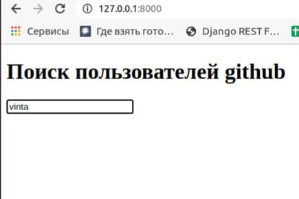
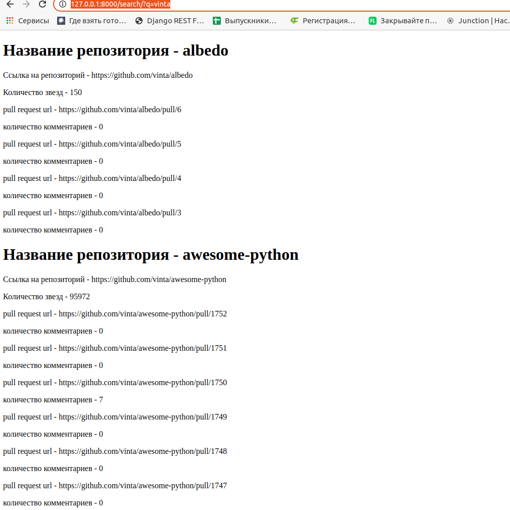

# Zipsale

В главную директорию проекта добавить файл .env

В нем добавить поле -
Authorization=Токен github

На работу потратил ~8 часов

Основное время потратил на изучение документации

Частично реализованы задачи:

- ссылки на смерженные пул-реквесты от пользователя;
- ссылки на несмердженные пул-реквесту от пользователя;

Не успел найти как разделить смерженные и несмердженные, отдает все.

